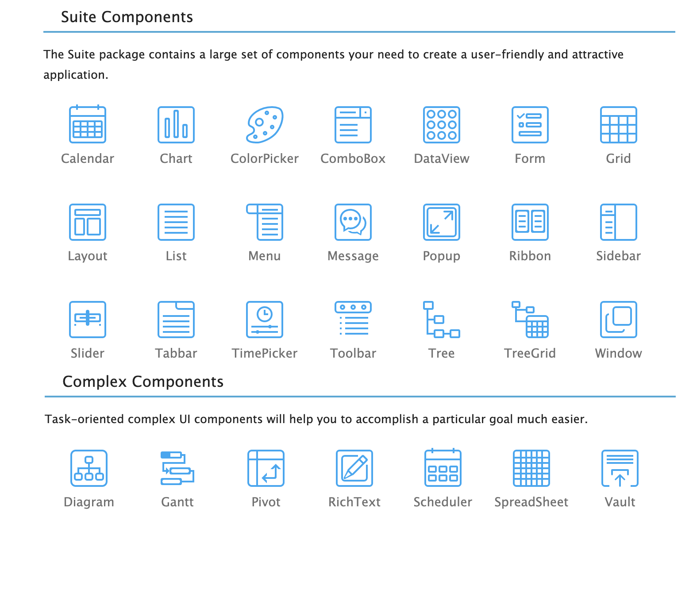

# DHX v6.x

This code is downloaded from the [dhx](dhtmlx.com) website and I stored in my github for reference and ease of access. The code can be downloaded in zip format and is hard to quickly look at.

@see [here](https://forum.dhtmlx.com/t/simple-example-for-e-g-layout/68125/2) for discussion.

For the official full suite, see [github.com/DHTMLX/dhtmlx-suite.gpl](https://github.com/DHTMLX/dhtmlx-suite-gpl)

# NPMJS

- [dhx-suite](https://www.npmjs.com/package/dhx-suite)

## or individual components

- [dhx-calendar](https://www.npmjs.com/package/dhx-calendar)
- [dhx-treegrid](https://www.npmjs.com/package/dhx-treegrid)
- [dhx-chart](https://www.npmjs.com/package/dhx-chart)
- [dhx-grid](https://www.npmjs.com/package/dhx-grid)
- [dhx-tree](https://www.npmjs.com/package/dhx-tree)
